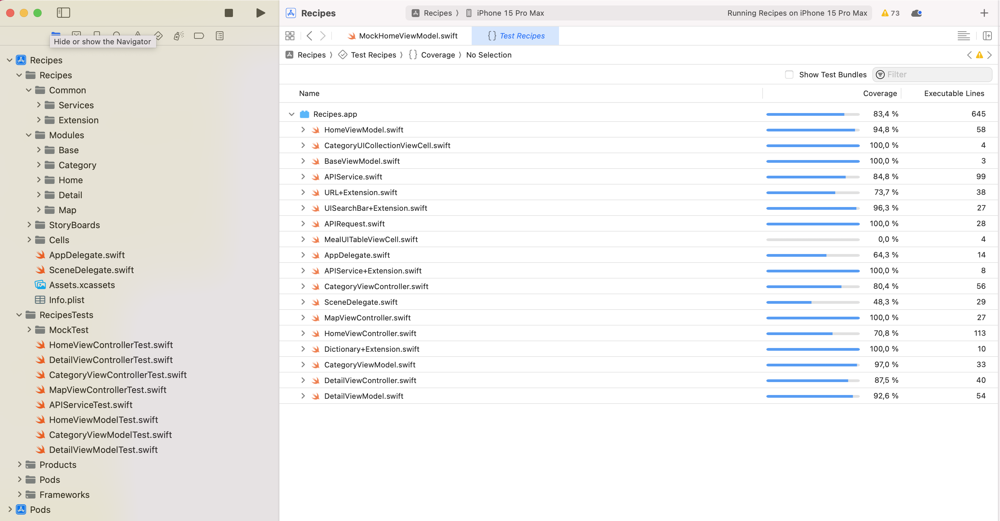

# Recipes

App de recetas, se construyó sobre Xcode 15.1 y se uso la arquitectura MVVM ya que era pequeña y basica, se adaptaba perfectamente.
La version minima de iOS es la 13.0 y corre en cualquier versión posterior.

Esta APP se adapta a multiples dispositivos o tamaños de pantallas (Se crearon los constraints correspondientes).

## HTTP
Se uso la API https://www.themealdb.com/api.php, para acceder la informacion de las recetas ya que es libre y tiene imagenes.

- www.themealdb.com/api/json/v1/1/categories.php       (Obtener las categorias)
- www.themealdb.com/api/json/v1/1/filter.php?c=Seafood (Obtener recetas por categoria)
- www.themealdb.com/api/json/v1/1/lookup.php?i=52772   (Obtener detalle de la receta)

Para conectarse a esta API se usa la clase APIService que usa el objeto APIRequest(Patron de diseño Builder) que se usa para construir peticiones HTTP de tipo (GET, POST, PUT, DELETE), para esta prueba solo fue necesario el tipo GET.

## Architecture
- MVVM Design Pattern
## Framework
- UIKit
- SDWebImage (Para descargar las imagenes y almacenar en cache)
- SkelentonView (Se usa para indicar que esta realizando algun proceso)
- SwitLint (Me gusta mucho esta libreria para tener mi codigo siempre ordenada y con las buenas practicas de swift)

## Pruebas unitarias
En pruebas unitarias se alcanzó una cobertura 84%, teniendo 100% cubierto los ViewModels y logica de negocio.
Se uso inyeccion de dependencias y se hicieron los mocks correspondientes para cada caso.

## Pantalla mapa
Como la API no tenia ningun dato de coordenadas, la latitud y longitud se crea de manera aleatoria cada que ingresa a la vista del mapa (Vistra creada programaticamente - Sin storyboard) para ubicar el marcador.

## Screenshots
Dentro de la carpeta screentshop hay de 3 modelos diferentes de iPhone.
                
